# [Animal Crossing DIY Recipe]("https://animal-crossing-recipe.herokuapp.com/")
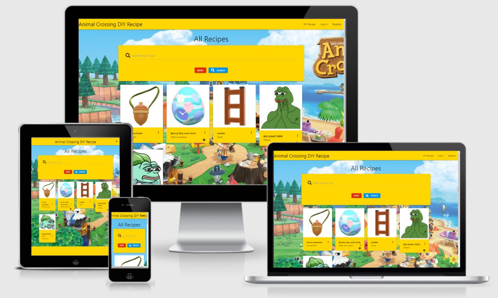 

This Website focuses solely on the DIY Recipes available in Animal Crossing: New 
Horizons. Search for recipes here and craft it in game. But wait, you discovered a 
recipe?! Feel free to ADD the recipe by yourself here if its not on the site already!

- ## User Stories
   - ### As a New Visiter:
        As a new visitor of the site, I wish to:
        1. Find Recipe that I need.
        2. Browse Recipe without loggin.
        3. Register for an account.

    - ### As a Registered User:
        As a user of the site, I wish to:
        1. Log in to the site.
        2. Edit, Remove and Add recipes.
        3. View recipes that I added. 

    - ### As a Administrative User:
        As a administrative of the site, I wish to:
        1. Delete and edit existing recipes that is innapropriate. 
        2. Delete and edit existing recipes that have wrong information.
        3. Add new Type of recipe.

- ## Design
   - ### Color Theme
      The main colours used are Yellow and a Background Image of Animal Crossing.
   - ### Font
      1. Dela Gothic One as the main heading choices.
      2. Kiwi Maru as the normal font.
      3. Sans Serif will be the fall back font if all fonts don't work.
   - ### Wireframe
      1. [Desktop and Mobile Wireframe](./static/readme/animal-crossing.pdf)
      2. Tablet is the same as Desktop version.

- ## Features and Functionality
   - ### Nav Bar and footer
       Nav bar is fixed at the top for easier navigation and footer is fixed at the bottom
       for social media. On smaller device, the nav bar will be compressed into a side slide
       menu which can be open by clicking on the down arrow button.

    - ### Home Page
        There will be a panel describing what this website is for, what type of game is Animal
        Crossing and what/how do you do with crafting. There is also a button to redirect to 
        the Recipes page.

    - ### DIY Recipe page
        A search bar will be on top of the page for users to search for existing reicpes and also to make
        sure users doesn't add an existing recipe to the site. Below the search bar will be where all the
        recipes card be, users can click on the image to triggers more information to be shown. Only user
        that created the recipe can edit or remove it.

    - ### Log In page
        Registered user can input their username and password info to log in to the site. If either one of the
        info is incorrect, a flash message will appear to inform the user.

    - ### Register page
        Non-user can visit this page to register and unlock more function. They will have to input a valid
        username and password on the form.

    - ### Profile page
        Page will show user's profile with their name and the recipe they added to the site. For conveniency
        user's can also edit or remove their recipe on this page.

    - ### Add DIY Recipe page 
        User can feel free to add recipe they found in game here by filling the form with valid input. If there's
        existing recipe a flash message will appear to warn user. 

    - ### Manage Type page
        Admin only page, it's for admin to add more type choices in the website for user to choose from. Admin can 
        remove and edit the Type here as well.

    - ### Edit Recipe page
        This function can be access in user's profile and DIY Recipe page if that recipe belong to the user. Can change
        or update previous information here.

    - ### Edit Type page
        This function is only available for admin in the manage type page, it's for admin to change the type.

    - ### Remove button
        This function can be access at all recipes card and type. When removing a recipe/type a popup will appear to warn
        user/admin before they want to remove it.

    - ### Custom error 404 page
        An errorhandler code created for a custom 404 page. The page will advise the visitor/user that an error has 
        occured and a link to redirect them back to the homepage.

- ## Technologies Used
   - ### Languages
      1. [HTML](https://en.wikipedia.org/wiki/HTML)
      2. [CSS](https://en.wikipedia.org/wiki/CSS)
      3. [Javascript](https://en.wikipedia.org/wiki/JavaScript)
      4. [Python](https://www.python.org/)

   - ### Frameworks, Libraries & Programs Used
      1. [Materialize v1.0.0](https://materializecss.com/) (Responsiveness and styling of the website.)
      2. [Google Fonts](https://fonts.google.com/)  (Used to obtain my fonts.)
      3. [Font Awesome v5.14.0](https://fontawesome.com/) (Used on all pages to add icon for aesthetic and UX purposes.)
      4. [GitPod](https://www.gitpod.io/) (Used terminal to git commit and git push to GitHub. Also used for version control.)
      5. [GitHub](https://github.com/) (Store projects after being pushed from Gitpod.)
      6. [Balsamiq](https://balsamiq.com/) (Used to design the layout of the website.)
      7. [PicResize](https://picresize.com/) (Used for resizing images that are too large.)
      8. [Flask](https://flask.palletsprojects.com/en/1.1.x/) (A Python framework and used with Jinja2 templating language. This is 
      used for generating HTML templates and accessing/processing data sent from the frontend.)
      9. [jQuery](https://jquery.com/)(A Javascript library that simplifies manipulation of of the HTML DOM.)

- ## Testing
     1. Tested HTML code via [W3C Markup Validator](https://validator.w3.org/) There were errors showing where the validator is unable to read the Jinja2 language. 
     Flask creates HTML files using templates, by pulling variables from the backend.
     2. Tested CSS via [W3C CSS Validator Services](https://jigsaw.w3.org/css-validator/) and results show 1 warning about imported style sheets are not checked in direct input and file upload modes but it's not affecting the site. 
     3. Tested Javascript via [JSHint](https://jshint.com/) there were no issues.
     4. For the Python code, the cornflaked-linter(flake8) extension is installed in the development environment. This gave a live validation check for the code.
     5. The Website was tested on Google Chrome and Firefox and there are no errors.
     6. The website was viewed on a variety of devices such as Desktop, Laptop, iPhone 7, 8 & X and there are no errors.
     7. A large amount of testing was done to ensure all pages and javascript were working correctly.

  ### Testing - Search Bar
    Testing was done on the search bar by typing the recipes name that exist and the recipe that does not exist. By clicking on the Reset button
    the search bar will be empty again.
     - The searched recipe appear when it exist in database. 
    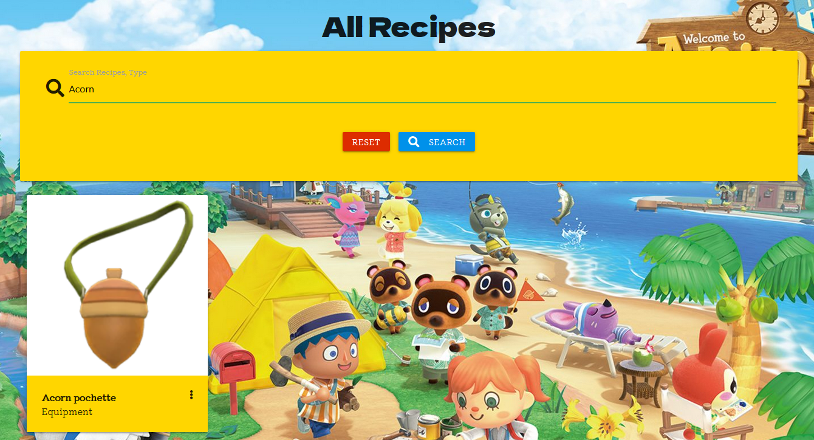 
     - The searched recipe does not appear and a message of no result found appear when it does not exist in database.
    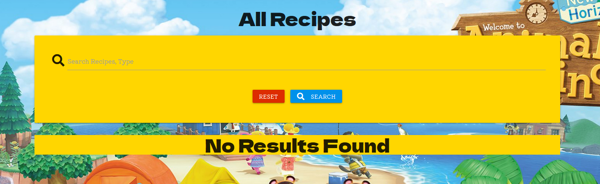 

  ### Testing - Log In and Register Form
    Testing was performed for the Form Submission to ensure that the form is filled out correctly and without empty fields.
     - A red line appears and please fill out this field message appear when there is an empty entry or less than 5 characters in "Username" and less than 8 characters in "Password" field.
    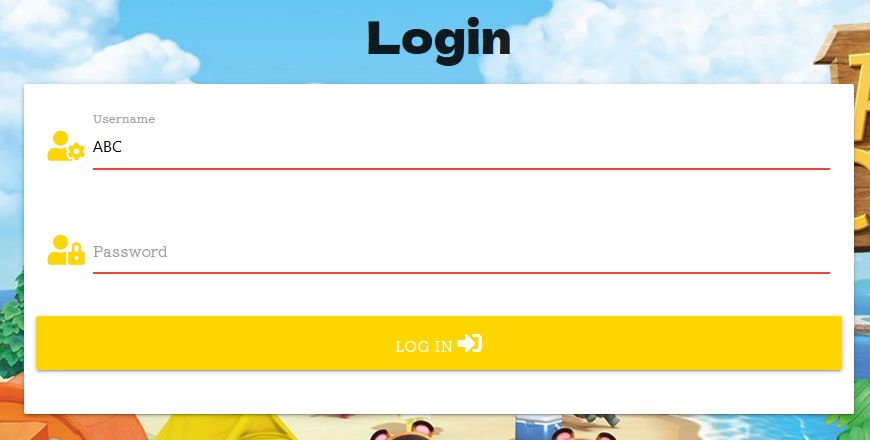 
    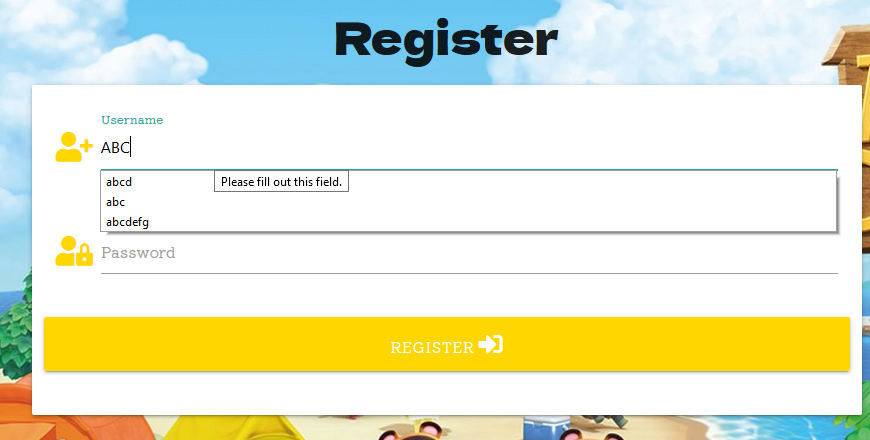 

  ### Testing - Remove button
    Testing was performed on the remove button for both recipes and types.
     - A pop up warning message will appear when you click the remove button to double confirm if you really want to remove it.
    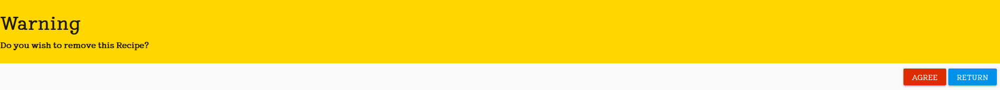 

  ### Testing - Edit Button
    Testing was performed on the Edit button for both recipes and types.
     - By clicking on the button, it will redirect you to the edit recipe page where all the information will be filled.
    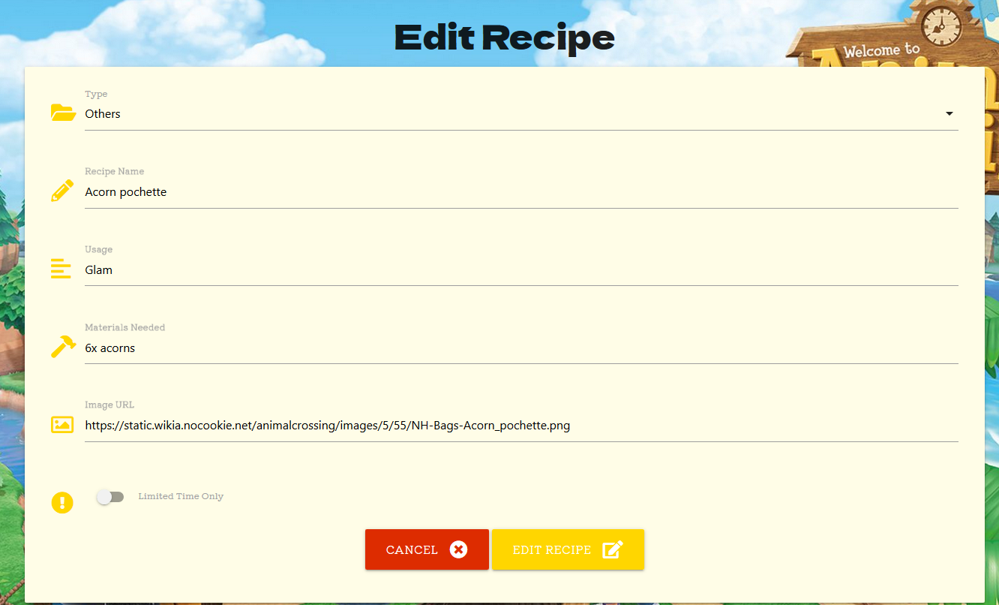
    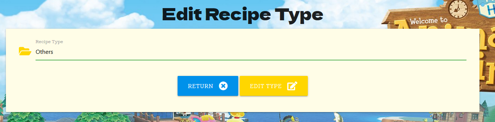
    - A red line appears if you try to leave any one of the fill empty.
    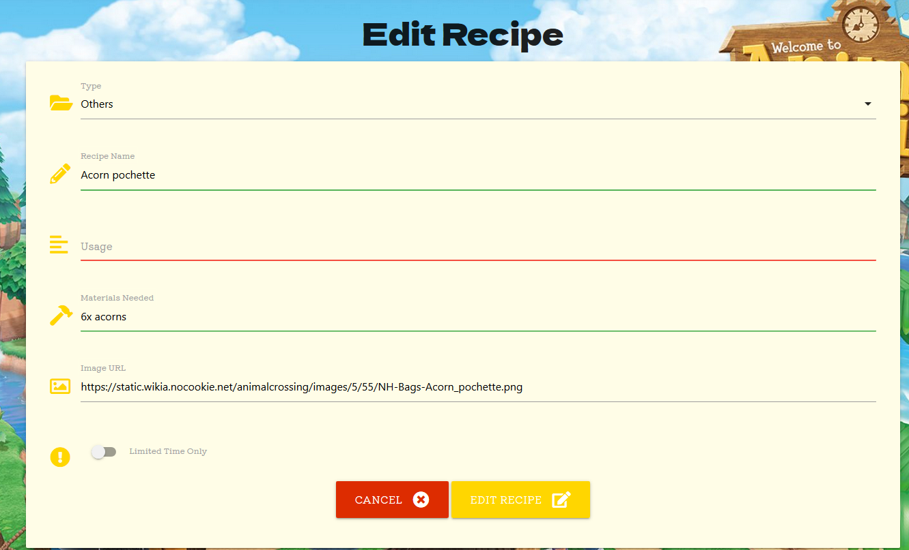
    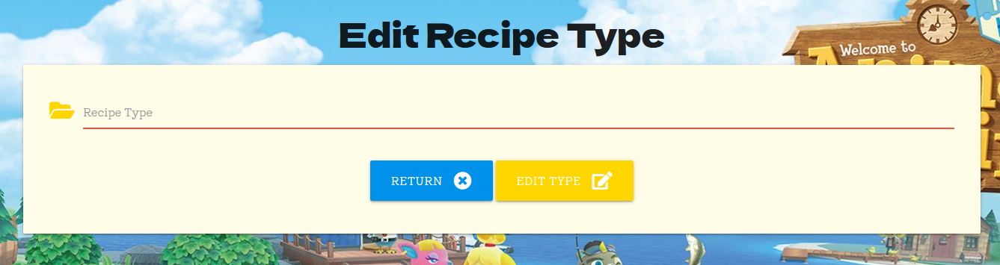 
    - By successfully edit the recipe, the website will redirect back to DIY Recipe and a message will appear stating the update is done.
    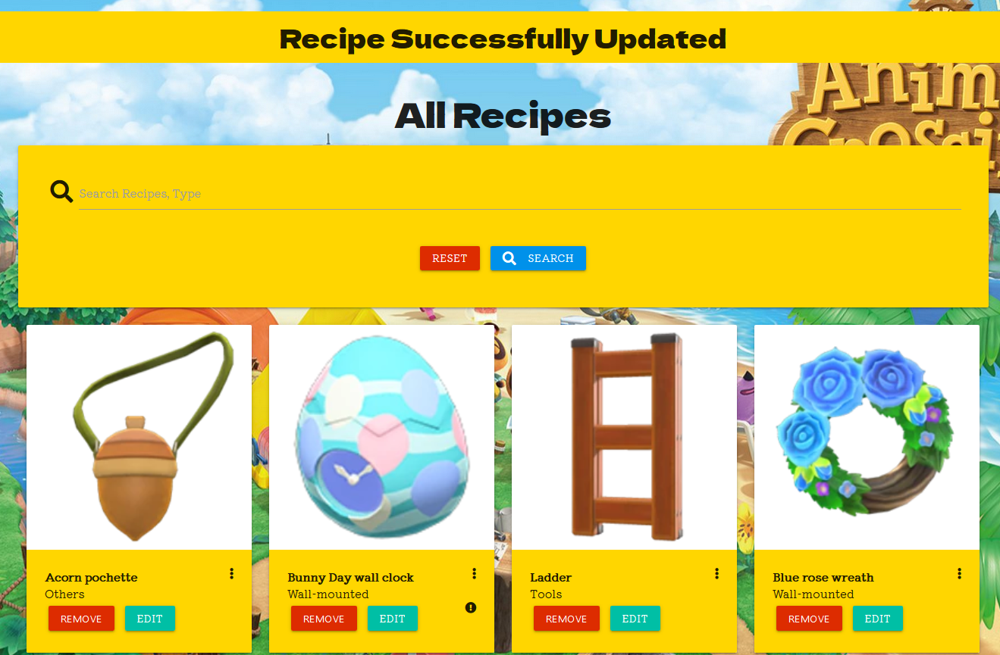 
    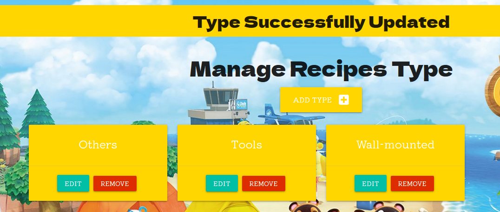

  ### Testing - Add Recipe
    Testing was performed on the Add Recipe page to ensure that the form is filled out correctly and without any empty fields.
    - A red line appears and you won't be able to change it if there's an empty entry in any field or less than 5 characters.
    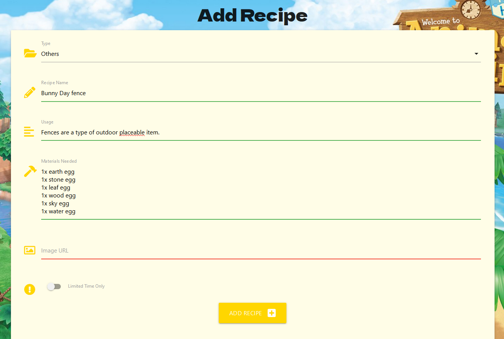
    - By successfully adding the recipe, the website will redirect back to DIY Recipe and "Recipe is added" message will appear.
    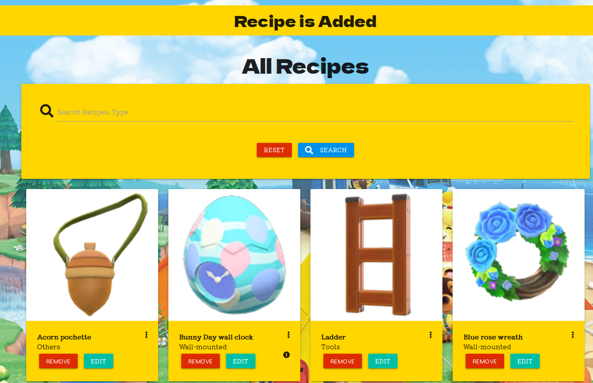

  ### Testing - Add Type
    Testing was performed on the manage type page to ensure the add type button works and all form is filled out correctly without any empty fields.
   - A red line appears if there's an empty entry or less than 3 characters.
    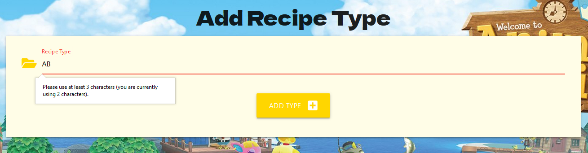
    - By successfully adding the type, the website will redirect back to Manage Type and a message will appear stating a new Type is added.
    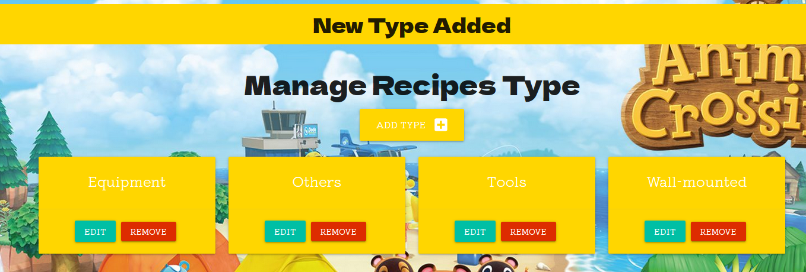

  ### Testing - Error Page
   Testing was performed when trying to attempt to visit pages that Visitor/Non-user try to access to site that is only for User and Admin.
   Testing was also performed when trying to access pages that doesn't exist in this website.
    - By accessing to pages that's not allowed or doesn't exist, a custom error page will appear with a link to go back to Homepage.
    

- ## Testing User Stories from User Experience (UX) Section
    As a visitor of the site, I wish to:

  - I would like to browse the website without registering or signing up.

    Visitor can browse the recipes anytime they want without register or logging in.

  - I would like to register an account for the website. 
    
    Visitor can register an account for free and the link can be found via navbar.

  - I would like to register an account for the website.

  As a Registered User of the site, I wish to:

  - I would like to login to the website.
    
    User can find the log in page from the navbar.

  - I would like to edit the recipes.

    User can click the Edit button on the recipe at either DIY recipe page or Profile page to start 
    editing recipe that's created by user.

  - I would like to add a recipe to the website.

    User can add recipe by clicking on the Add DIY Recipe on navbar.

  - I would like to view my recipes.
    
    User can view it on their profile

  - I would like to remove my recipe. 

    User can remove recipe that's created by user on user's profile or DIY recipe page and a popout message will 
    appear as a warning to confirm remove.

  As a Administrative of the site, I wish to:

  - I would like to add a type to the database. 

    Admin can add more type selection by clicking on Manage Type at navbar that's only accessable for admin only.

  - I would like to edit an existing recipe.

    Admin can find the Edit button on the recipe at either DIY recipe page or profile page to start 
    editing recipe.

  - I would like to remove an existing recipe.

    Admin can find the delete button on the recipe at either DIY recipe page or profile page to remove the recipe and
    a popout message will appear as a warning to confirm remove.
  

- ## Database
    - ### Mongo DB
        MongoDB is the database used to store my collection of data. There are three collections of data - recipes, types and users. 
        Each of the collections have a simple key-value format.
        - ### recipes
            This contains the recipe's name, type, usage, material needed, image link, limited time and created by who. It's all string type.
            Recipes can be edited by the creator of the recipe and no duplicate recipe can be added.
        - ### types
            This contains the types of recipe available for user to choose from and it can only be access by Admin only.
        - ### users
            This contains the user's username and password info and will inform user's when the username is taken.

- ## Deployment
   - ### MongoDB Setup for Cloning or Forking the Project.
        
        1. Sign up to MongoDB.
        2. Select the "Shared Clusters" option.
        3. Select the AWS Cloud Provider.
        4. Select a region, in my case I chose Singapore as it is the closest to me.
        5. Select the M0 Sandbox tier, which is the Free tier.
        6. Name your Cluster in the Cluster Name field.
        7. Select "Create Cluster".
        8. In the menu on the left, select "Database Access" under the "SECURITY" category.
        9. Select "Add New Database User" and create a user for access to the datase.
        10. Select "Clusters" tab.
        11. Click the "Collections" button.
        12. click "Add my own data" - this is where you create the database.
        13. Add three collections called "recipes", "types" and "users".
        14. Go to Clusters and select "Connect"
        15. Select "Connect your application"
        16. Ensure that the Driver is "Python" and Version is "3.6 or later".
        17. Copy and save the URL string that starts with "mongodb+srv://..."
        18. Within your project, the following environment variables will need to be setup:
        ```
        app.config["MONGO_DBNAME"] = "Your own database name"
        app.config["MONGO_URI"] = "The URL string, ensure you replace the password holder with your own user password"
        app.secret_key = "A random string" (Use a random key generator for security)
        ```

   - ### Deploying to Heroku.
        To deploy our application on Heroku, it is essential to have a requirements.txt file and a Procfile. 
        The two files will inform Heroku what dependencies are required to run the application, 
        which file to run and ultimately, launch the application.
        A GitHub repository, which will contain the project is also required.

        1. Create a requirements.txt file by typing in the terminal: "pip3 freeze --local > requirements.txt".
        2. Create a Procfile by typing in the terminal "ech web: python app.py > Procfile"
        3. Create an account on [Heroku](heroku.com) and then log in.
        4. Select "New" and then "Create New App".
        5. Choose a name for the app and a region.
        6. Select "Create app"
        7. In the Deployment method section, select the GitHub option. 
        8. In the connect to GitHub section, make sure the GitHub profile is displayed.
        9. Select the repository in the list of the project and then click "connect to this app".
        10. Go to settings and in the Config Vars section, click "Reveal Config Vars".
        11. Input all the config variables.
        12. Return to the Deploy tab.
        13. Check the "Enable Automatic Deploys"
        14. Select the "master" branch to deploy.
        15. Click the "Deploy Branch" button. 
        16. Scroll to the top and click "Open app" to view the deployed website.

   - ### Forking the Project.

        1. Go to github.com and log in.
        2. Go to my [repository](https://github.com/Tanyapond/animal-crossing-recipe).
        3. At the rop right of the page, click the "fork" button.
        4. Make any changes to the project as you wish.
        5. If you want to merge the changes to the project: 
        6. Select the "pull request" button from your forked repository.
        7. Select the button "new pull request".
        8. Select the branches to merge with.
        9. Select the "Create pull request" button.

   - ### Cloning the Project.
        1. Go to my [repository](https://github.com/Tanyapond/animal-crossing-recipe).
        2. Click the "Code" button and under the HTTPS tab, copy the URL link by clicking the copy icon.
        3. Open Git Bash and change the current working directory to the location where you want the cloned directory.
        4. Type "git clone" followed by the URL you copied earlier, in this case "https://github.com/Tanyapond/animal-crossing-recipe"
        5. Press Enter to create your local clone.

- ## Tutorials and Credits
   - ### Code
      1. [Materialize v1.0.0](https://materializecss.com/) For majority of the page like navbar, card panel, card reveal, popup message and color.
      2. Code Institute Backend Development Mini Project video.
      3. [StackOverflow](https://stackoverflow.com/questions/28556370/confirmation-modal-for-flask-not-working-in-a-loop) for the data target code.
   - ### Content
      1. [Fandom](https://animalcrossing.fandom.com/wiki/Animal_Crossing_Wiki) For the game and recipes description.
      2. [Animal Crossing](https://animal-crossing.com/) The actual game for recipes.
   - ### Media
      1. [Fandom](https://animalcrossing.fandom.com/wiki/DIY_recipes) For all the recipes images.
      2. [WallpaperAccess](https://wallpaperaccess.com/) For the background image.

- ## Acknowledgements
    I want to thank Code Institute for the teaching program and my mentor, Cans Thank You for guiding me and congratulation on your newborn baby! 
    
